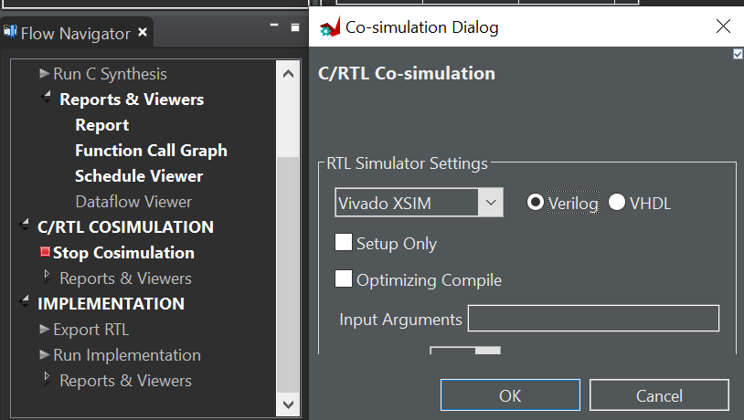
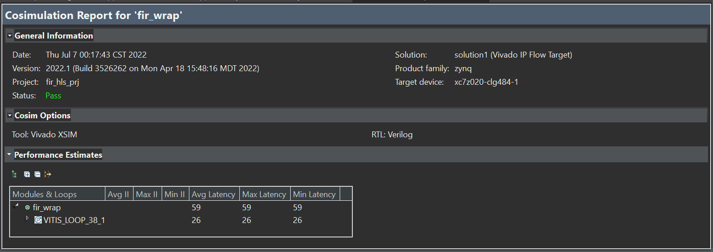
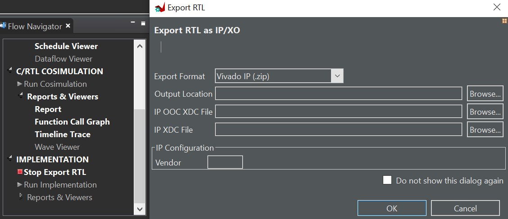
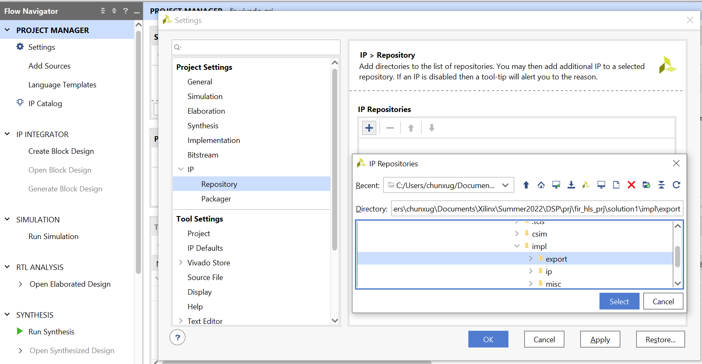
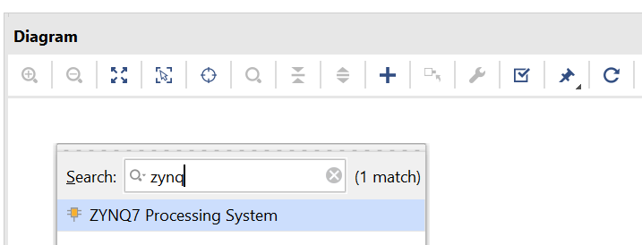
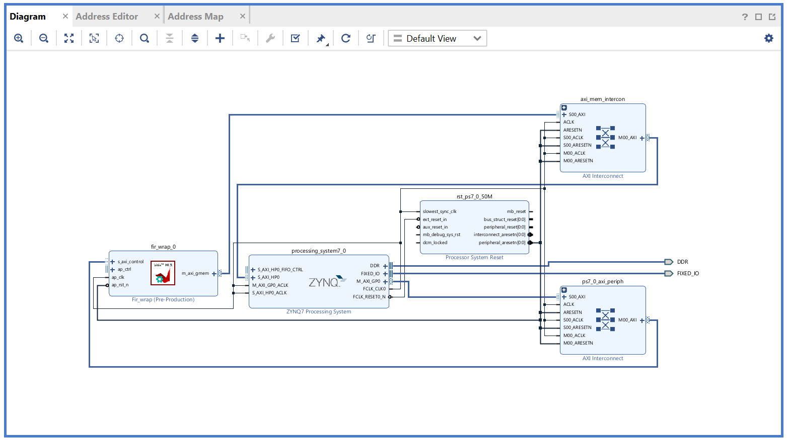
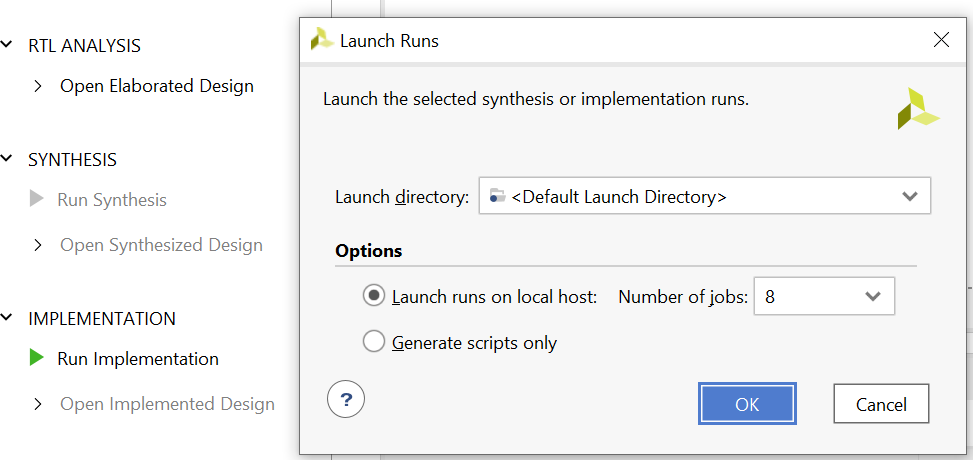

# Lab1 设计FIR滤波器分离鸟类声音(hw)

## 目标

在完成本实验后，您应当学会：

- 如何使用Vitis HLS构建一个项目

- 在Vitis HLS中进行仿真、综合与IP导出

- 使用Vivado对HLS导出的IP进行集成

- 使用PYNQ构建一个简单的应用

简而言之，您将掌握使用HLS进行加速核设计与部署到PYNQ的基本流程。出于篇幅限制，本实验仅介绍基本工具操作流程。

## 环境要求

- PYNQ-Z2远程实验室服务或物理板卡

- Vitis HLS

- Vivado

## 实验步骤

### 1. 在Vitis_HLS中设计FIR IP

#### 1.1 创建一个新项目

1. 打开**Vitis HLS**软件，点击**Create Project**，创建一个新的项目

2. 在**Project name**输入项目名**fir_hls_prj**，点击**Browse**选择一个合适的目录位置，点击**Next**
   
   

3. 点击**Add Files...**，将**src**目录下的**fir.h**和**fir.cpp**添加到项目中

4. 点击**Top Function**栏中的**Browse**按键，选择**fir_wrap**，这是我们进行综合时候的顶层函数，点击**Next**
   
   

5. 点击**Add Files...**，将**src**目录下的**fir_tb.cpp**添加到项目中，点击**Next**
   
   

6. 下面进入到**Solution Configuration**界面，保持其他选项不变，在**Part Selection**栏最右侧点击 **....** 字样的按钮，在**Search**栏的搜索框中输入**xc7z020clg484-1**，即**PYNQ-Z2**板卡所使用的器件型号
   
   

7. 点击**Finish**，完成项目的创建

#### 1.2 C-Simulation

1. 在完成项目创建后，**Vitis HLS**会跳转到新的界面，其由四个主要部分组成：
   
   1. 左上方的**Explorer**，其包含了工程中的各个文件
   
   2. 左下方的**Flow Navigator**，其展示了HLS设计中的各环节
   
   3. 右上方的**编辑器区域**，开发者在此修改设计的代码
   
   4. 右下方的**Console**，包含了控制台、报错信息、版本控制等

   

2. 下面，我们对设计进行C仿真。在左下方的**Flow Navigator**中点击**Run C Simulation**，在弹出的**C Simulation Dialog**窗口中不做改动，点击**OK**进行C仿真

   

3. 等待数秒，在仿真完成后**Vitis HLS**自动打开一个log文件，可以看到已经设计通过了C仿真
   
   

#### 1.3 C-Synthesis

1. 下面，我们对设计进行C综合。在左下方的**Flow Navigator**中点击**Run C Synthesis**，在弹出的**C Synthesis - Active Solution**窗口中保持各选项不变，点击**OK**开始综合
   
   

2. 等待数秒，**Vitis HLS**会将其综合的各步骤的信息打印在**Console**中

3. 综合完成后，会弹出 **Systhesis Summary(solution1)** 窗口，我们可以在此看到**Vitis HlS** 给出的时钟频率信息、时钟周期数和资源消耗等
   
   

#### 1.4 C/RTL Co-simulation

1. 下面，我们对设计进行C-RTL联合仿真。在左下方的**Flow Navigator**中点击**Run C/RTL COSIMULATION**，在弹出的**Co-simulation Dialog**窗口中保持各选项不变，点击**OK**开始综合
   
   

2. 等待约1分钟，C/RTL联合仿真的综合时间通常较长，仿真结束后会弹出**Co-simulation Report(solution1)** 窗口 ，包含了是否通过仿真、性能估测等信息
   
   

#### 1.5 导出RTL

1. 下面，我们对设计进行RTL导出。在左下方的**Flow Navigator**中点击**Export RTL**，在弹出的**Export RTL**窗口中保持各选项不变，点击**OK**开始RTL的导出
   
   

2. 等待约半分钟，**Console**中打印**Finished Export RTL/Implementation.** 表明RTL设计已经导出完成，你可以在**\fir_hls_prj\solution1\impl\export.zip**找到导出的文件

3. 为了后续使用的便利，请将**\fir_hls_prj\solution1\impl\export.zip**文件解压到其所在目录下，即得到一个**\fir_hls_prj\solution1\impl\export** 文件夹
   
   

4. 至此，我们已经完成了FIR加速核的设计与导出

### 2. 在Vivado中进行IP集成

#### 2.1 创建一个新Vivado项目

1. 打开**Vivado**软件，点击**Create Project**，创建一个新的项目，点击**Next**

2. 在**Project name**输入项目名**fir_vivado_prj**，点击右侧的 **...** 按键选择一个合适的目录位置，点击**Next** 
   
   

3. 进入**Project Type**界面，勾选上**Do not specify sources at this time**，再点击**Next**
   
   

4. 进入**Default Part**界面，在**Search**栏中搜索**xc7z020clg484-1**，将其选中，再点击**Next**
   
   

5. 点击**Finish**完成项目创建

#### 2.2 导入IP

1. 我们需要首先将从**Vitis HLS**中导出的IP导入到**Vivado**中，点击左侧窗口**Flow Navigator**中的**Settings** 选项，弹出**Settings**窗口

2. 将左侧的**Project Settings**中展开**IP**栏目，选中**Repository**项，点击右侧面板中的 **+** 按键，在弹出窗口中选择刚才解压出来IP，即**\fir_hls_prj\solution1\impl\export**，在点击**Select**
   
   

3. 可以看到对应的IP已经被成功添加到了工程中，在两个窗口中依次单击**OK**来关闭这些窗口
   
   

#### 2.3 创建Block Design

1. 下面我们创建一个**Block Design**，利用**Vivado**的IP集成功能来构建完整系统。在左侧的**Flow Navigator**中点击**IP INTEGRATOR > Create Block Design**，在弹出的**Create Block Design** 窗口中保持各选项不变，设计名称使用默认的**design_1**，点击**OK**创建**Block Design**
   
   

2. 在出现的**Diagram**窗口中点击上方的 **+** 按钮，会弹出一个搜索框，在输入栏中键入**zynq**，双击备选项中出现的**ZYNQ7 Processing System**，即可将该IP添加到设计中
   
   

3. 在窗口上方会出现蓝色下划线提示**Run Block Automation**, 单击该区域弹出对应窗口，我们保持默认设置不变，直接点击**OK**
   
   

4. 下面，我们需要对上述**Processing System**进行配置，添加一个HP端口
   
   - 双击**Diagram**中的**processing_system7_0**模块，弹出**Re-customize IP**窗口
   
   - 在左侧**Page Navigator**中选择**PS-PL Configuration**页面，展开右侧选项中的**HP Slave AXI Interface**，勾选上**S AXI HP0 interface**选项
   
   - 点击**OK**
   
   

5. 点击Diagam窗口上方的 **+** 按钮，搜索**fir**，可以看到我们刚才导入的IP已经可以使用了，双击**Fir_wrap**以将其添加到设计中
   
   

6. 下面我们对设计进行自动连线。点击窗口上方的蓝色下划线提示**Run Connection Automation**，弹出对应窗口，将左侧**All Automation** 选项勾选上，再点击**OK**
   
    

7. 系统将根据对应接口自动进行连线，我们可以得到如下图的设计
   
   

8. 在**Diagram**上侧的工具栏中点击勾形图标**Validate Design**，对设计进行验证
   
   

9. 在左侧的**Source > Design Sources > design_1**选项上右键，选择**Generate Output Products**
   
   

10. 在弹出窗口中保持各配置不变，点击**Generate**，这一过程将耗费约1分钟的时间
    
   

11. 在左侧的**Source > Design Sources > design_1**选项上右键，选择**Create HDL Wrapper**，在弹出窗口中保持选项不变并点击**OK**，完成后可以看到在**design_1.bd**上层嵌套了一层**design_1_wrapper.v**文件
    
   

#### 2.4 综合与生成比特流

1. 在左侧的**Flow Navigator**中选择**Run Synthesis**，在弹出窗口中保持选择不变并选择**OK**
   
   

2. 综合完成后，会弹出**Synthesis Completed**窗口，在**Next**栏中保持默认的**Run Implementation**选项，并点击**OK**，如果出现新弹窗，同样保持默认选项并点击**OK**即可
   
   

3. **Implementation**结束后，会弹出**Implementation Completed**窗口，在**Next**栏中选择**Generate Bitstream**选项，并点击**OK**，如果出现新弹窗，同样保持默认选项并点击**OK**即可
   
   

4. 比特流生成后，会弹出**Bitstream Genreation Completed**窗口，我们直接点击**Cancel**即可
   
   

5. 至此，我们已经完成了硬件部分的设计与导出 

### 3. 构建PYNQ设计

#### 3.1 提取bit与hwh文件

1. 在文件管理器中访问 **\fir_vivado_prj\fir_vivado_prj.runs\impl_1** 目录，该目录下的**design_1_wrapper.bit**文件即为生成的比特流文件，将其复制到自己的文件夹中保存，并重命名为**fir.bit**
   
   

2. 在文件管理器中访问 **\fir_vivado_prj\fir_vivado_prj.gen\sources_1\bd\design_1\hw_handoff** 目录，其中的**design_1.hwh**即为我们需要的**hardware handoff**文件，将其复制到自己的文件夹中保存，并重命名为**fir.hwh**
   
   

#### 3.2 访问Jupyter

1. 请先参考下发的《PYNQ远程实验室指南》完成账号注册与**Jupyter**访问

2. 登录**Jupyter**界面，点击界面右上方的**upload**按钮，将以下文件上传到开发板上:
   
   - **/jupyter** 目录下的**fir.ipynb,** **chaffinch.jpg,** **curlew.jpg,** **birds.wav**
   
   - 上一步中得到的**fir.bit**与**fir.hwh**文件
     
     - 如果你在前面操作中导出失败了，你也可以先使用 **/overlay** 目录下的**fir.bit**与**fir.hwh**文件上传，以完成余下实验
   
    

#### 3.3 部署与运行Overlay

1. 在**Jupyter**中进入到**fir.ipynb**页面，**Kernel**自动加载完成显示为**Python3**字样

2. 点击窗口上侧的**Run**按钮，**Jupyter Notebook**会执行当前**Cell**，同时自动切换到下一个**Cell**
   
   

3. 完成按照顺序依次点击**Run**至结束即可，各代码块的含义在**Jupyter Notebook**中已经标注，请阅读**Jupyter Notebook**中的信息继续完成实验。
